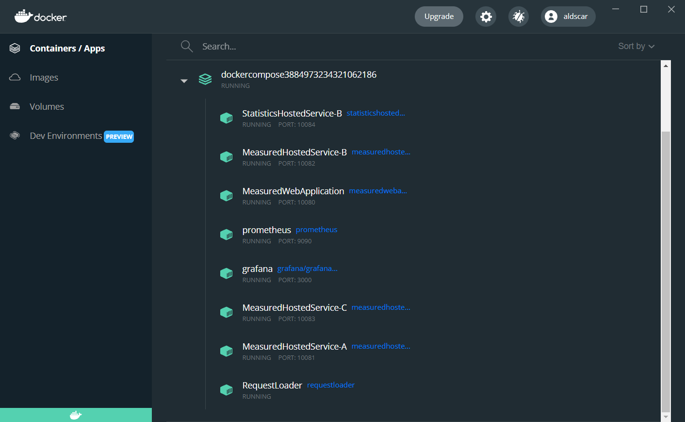
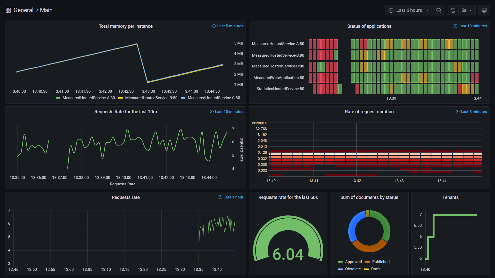

# Overview

The solution demonstrates how to collect [Prometheus](https://prometheus.io/) metrics for .NET applications and how to render them in [Grafana](https://grafana.com/). Monitored applications are following:
* one API application - MeasuredWebApplication - for demonstration how to track requests rates
* one hosted service - MeasuredHostedService - for emulation memory consumption
* one hosted service - StatisticsHostedService - for gathering business-related statistics and customized metrics

Prometheus server, Grafana server and .NET applications are containerized. In addition, solution includes minimal linux-based container with powershell script for running http requests to api application.  

All .NET applications are armed with HealthCheck endpoint, which returns randomized service status. 

# How to run
The easiest way to run is to use docker. Solution configured to run following containers:
* Prometheus, 
	* published via http://localhost:9090; 
	* Prometheus configuration file mapped from host `Prometheus\prometheus.yml`   
* Grafana, 
	* published via port http://localhost:3000, 
	* user/password: admin/admin; 
	* dashboard database file mapped from host `Grafana\Data\grafana.db`
* RequestLoader, powershell container with simple script for sending requests to api application
	* powershell script mapped from host `RequestLoader\Run.ps1`
* 1 instance of MeasuredWebApplication
	* published on http://localhost:10080
* 3 instances of MeasuredHostedService
* 1 instance of StatisticsHostedService

In Visual Studio 2022, select project "docker-compose" and run. Check if all containers are on in Docker Desktop:

Open Grafana published via http://localhost:3000. After logging in you should see preconfigured dashboard like this:

# Misc

List of Prometheus well-known [exporters and integrations](https://prometheus.io/docs/instrumenting/exporters/) includes among others following:
* RabbitMQ
* DockerDaemon
* Nomad
* Azure Monitor
* Jira
* Jenkins
* Windows
* MongoDB
* MSSQL
